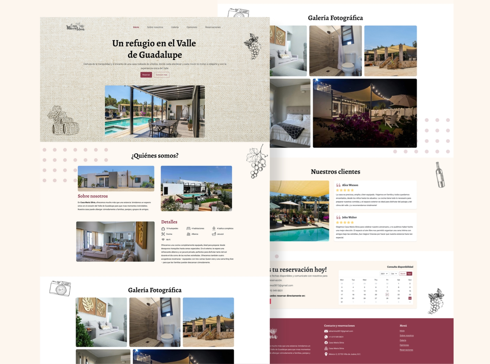

# Casa María Silvia Landing Page
> Bootstrap Landing Page for a vacation house rental, where you will find details about the house and reservations info.
> Live demo [_here_](https://casamariasilvia.vercel.app/).


## Table of Contents
* [General Info](#general-information)
* [Technologies Used](#technologies-used)
* [Features](#features)
* [Screenshots](#screenshots)
* [Setup](#setup)
* [Usage](#usage)
* [Project Status](#project-status)
* [Contact](#contact)


## General Information
Bootstrap Landing Page for a vacation house rental, where you will find details about the house and reservations info.


## Technologies Used
       


## Features
- Responsive design
- Navbar scroll effect
- Full height header/hero
- Light Theme

## Screenshots



## Setup
This website is built with [Bootstrap](https://getbootstrap.com/) and [Sass](https://sass-lang.com/). It uses [Font Awesome](https://fontawesome.com/) for icons.

In order to customize this website, you need to install [Node.js](https://nodejs.org/en/). Then, clone this repository and run:

```bash
npm install
```


## Usage
This will install Bootstrap, and Sass. To build your CSS files from Sass, run:

```bash
npm run sass:build
```

To watch your Sass files for changes, run:

```bash
npm run sass:watch
```

You can add Bootstrap variables to the `bootstrap.scss` file. You can look at the file `node_modules/bootstrap/dist/scss/_variables.scss` for a list of all the variables. Do NOT edit the `variables.scss` file directly, as it will be overwritten when you update Bootstrap.

To add your own custom styles, use the `styles.scss` file.

## Project Status
Project is: _in progress_

## Contact
Created by Abril Ramirez - feel free to contact me!


<a href="https://iscramirezabril.github.io/" target="blank"></a>
<a href="https://www.linkedin.com/in/abril-ramirez-flores-71a26b275/" target="blank"></a>
<a href="mailto:isc.ramirez_abril@outlook.com" target="blank"></a>

## Online Store
<a href="https://uxramirez.com/" target="blank"></a>

<a href="https://facebook.com/profile.php?id=61567738945172" target="blank"></a>
<a href="https://x.com/ux_ramirez" target="blank"></a>
<a href="https://instagram.com/ux_ramirez/" target="blank"></a>
<a href="https://www.youtube.com/channel/UCZg_yvr17lttzqy0BHasi9Q" target="blank"></a>

## On the Web
View my projects at:

<a href="https://www.behance.net/abrilramirez15" target="blank"></a>
<a href="https://dribbble.com/iscRamirezAbril" target="blank"></a>
<a href="https://github.com/iscRamirezAbril" target="blank"></a>